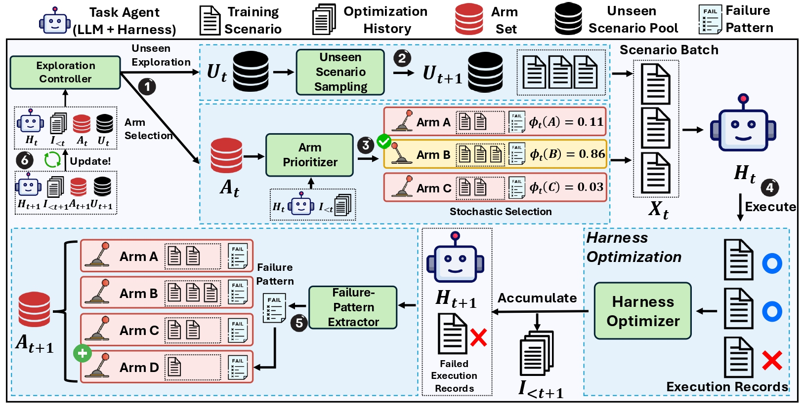

# ActiveSaddler: Automated Curriculum Learning for Agent Harness Optimization

**ActiveSaddler** is an automated curriculum for budgeted offline harness optimization. It treats
scenario selection as a non-stationary bandit whose arms are **failure patterns**: recurring,
repairable harness weaknesses instantiated online from diagnosed failures. At each iteration it
either explores unseen training scenarios or revisits a known arm, so the curriculum co-evolves with
the harness. This branch incorporates it into [AutoSaddler](https://github.com/microsoft/AutoSaddler)
V2 as the `activesaddler` task-selection policy.

📄 **[Paper](https://arxiv.org/abs/2610.00906)** · 🌐 **[Project website](https://autosaddler-projectpage.github.io/activesaddler/)**

<p align="center">
  
</p>

| Component | Role | Session |
|---|---|---|
| Exploration Controller | Decides whether to explore unseen scenarios (DRAW) or revisit a known arm (PULL) | `decide_arm` |
| Arm Prioritizer | Scores each arm's learning progress from severity, fixability, breadth, and side-effect risk, then samples an arm by softmax | `score_arms` |
| Failure-Pattern Extractor | Abstracts failures into symptoms and links them to existing arms or new ones | `extract_patterns` |

## Results

Test Pass@1 (mean ± std. over three test-time executions), with the same `gpt-5.5` models and the
same rollout budget (1,400 rollouts on GAIA2, 490 on Terminal-Bench 2.0):

| Harness | Type | GAIA2 Test (300) | Terminal-Bench 2.0 Test (40) |
| :--- | :---: | :---: | :---: |
| Default Agent / Terminus 2 | Manual | 53.6 ± 1.1 | 64.2 ± 2.9 |
| Terminus-KIRA | Manual | – | 69.2 ± 3.8 |
| GEPA | Optimizer | 54.2 ± 2.2 | 65.8 ± 5.2 |
| Meta-Harness | Optimizer | 54.2 ± 1.2 | 66.7 ± 5.2 |
| AutoSaddler | Optimizer | 55.4 ± 1.2 | 72.5 ± 0.0 |
| AutoSaddler w/ Category Acc. Order | Fixed curriculum | 55.9 ± 1.3 | 70.8 ± 1.4 |
| AutoSaddler w/ Scenario Acc. Order | Fixed curriculum | 55.7 ± 1.2 | 73.3 ± 1.4 |
| **ActiveSaddler** | **Adaptive curriculum** | **59.8 ± 1.0** | **80.0 ± 2.5** |

ActiveSaddler improves test Pass@1 by **+4.4** and **+7.5** percentage points over the same harness
optimizer (AutoSaddler) with a scenario order fixed before optimization. This repository includes
the GAIA2 integration through Meta-ARE.

## Setup

Install the repository with [uv](https://docs.astral.sh/uv/) (Python 3.12-3.14):

```bash
git clone -b feat/activesaddler https://github.com/microsoft/AutoSaddler.git
cd AutoSaddler
uv sync --extra dev --extra meta-are-setup
```

Clone the adapted Meta-ARE repository next to it, then provision the GAIA2 scenarios and the demo
filesystem:

```bash
cd ..
git clone https://github.com/pshlego/Meta-ARE.git Meta-ARE
git -C Meta-ARE checkout --detach 395d1dd512add1e3aeb5a6a092490768b51e3ce5
mkdir -p working_dir
cd AutoSaddler

# Smoke split (6 train, 1 dev)
uv run --extra meta-are-setup python scripts/meta_are/provision_gaia2_scenarios.py \
  --destination-root "$PWD/../Meta-ARE/datasets_local/gaia2_smoke" \
  --revision 78ea3bdbdeec2bdcd6afa5420915d8a22f23ed99
# Full split (75 train, 65 dev)
uv run --extra meta-are-setup python scripts/meta_are/provision_gaia2_scenarios.py \
  --destination-root "$PWD/../Meta-ARE/datasets_local/gaia2" \
  --revision 78ea3bdbdeec2bdcd6afa5420915d8a22f23ed99 \
  --manifest configs/datasets/GAIA2/train.json \
  --manifest configs/datasets/GAIA2/val.json
# Demo filesystem shared by both splits
uv run --extra meta-are-setup python scripts/meta_are/provision_demo_filesystem.py \
  --destination-root "$PWD/../meta_are_data/gaia2_filesystem" \
  --revision 132e26376f5e963bb59f64bcccdd02188cb08dee \
  --meta-are-project ../Meta-ARE
```

## Run

Two task-selection policies are provided:

| Strategy | Mini-batch sampling | Full profile | Smoke profile |
|---|---|---|---|
| `activesaddler` (ours) | Adaptive curriculum over failure-pattern arms | `configs/v2/meta_are_activesaddler_full.yaml` | `configs/v2/meta_are_activesaddler_smoke.yaml` |
| `epoch_shuffled` (AutoSaddler baseline) | Fixed epoch-shuffled mini-batches | `configs/v2/meta_are_full.yaml` | `configs/v2/meta_are_smoke.yaml` |

The smoke profiles use OpenAI `gpt-4.1-mini` for the task agent and judge and Anthropic
`claude-opus-4-6` for the optimizer; the full profiles use OpenAI `gpt-5.5` for all three. Export
the matching keys, then run from `working_dir` with a new run ID:

```bash
export OPENAI_API_KEY="..."
export ANTHROPIC_API_KEY="..."   # smoke profiles only

cd ../working_dir
RUN_ID="activesaddler-smoke-$(date -u +%Y%m%dT%H%M%SZ)"
uv run --project ../AutoSaddler python -m autosaddler.v2.cli \
  --config ../AutoSaddler/configs/v2/meta_are_activesaddler_smoke.yaml \
  --run-id "$RUN_ID"
```

Use another profile from the table for the full run or the baseline. Each run is written under the
config's `storage.run_root`, for example
`working_dir/outputs/v2_meta_are_activesaddler/runs/<run-id>/`. `result.json` holds the selected
harness and its development score, and `strategy/curriculum.json` records the curriculum: failure
patterns, PULL/DRAW decisions, and arm scores. To resume an interrupted run, repeat the same command
with the same run ID.

## Configuration

Switching between ActiveSaddler and the AutoSaddler baseline changes only
`optimization.task_selection`:

```yaml
optimization:
  task_selection:
    type: activesaddler        # epoch_shuffled for the AutoSaddler baseline
    batch_size: 3
    seed: 42
    settings:                  # activesaddler only
      softmax_temperature: 0.15                # arm-selection temperature (> 0)
      min_prob: 0.0                            # per-arm probability floor in [0, 1)
      ema_eta: 0.9                             # failure-activity EMA shown to the agent only
      pattern_extraction_timeout_seconds: 3600 # extract_patterns session timeout
      arm_scoring_timeout_seconds: 3600        # decide_arm and score_arms session timeout
```

See the [V2 architecture guide](docs/v2-architecture.md) for how the curriculum plugs into
AutoSaddler V2, and the [AutoSaddler README](https://github.com/microsoft/AutoSaddler/blob/main/README.md)
for the rest of the framework.

This project is available under the [MIT License](LICENSE).
