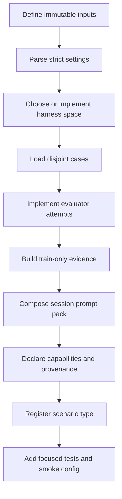

# V2 Scenario Integration

## Goal

A V2 scenario plugin adapts one optimization target to the core engine without putting target-specific
logic in `core`, `providers`, or `storage`. The plugin supplies a `ScenarioComponents` bundle:

- a harness space;
- an evaluator;
- an evidence builder;
- a prompt pack;
- disjoint train and development cases;
- required optimizer-provider capabilities; and
- resolved provenance entities.

Use `src/autosaddler/v2/plugins/meta_are` as the production Git-harness example and
`src/autosaddler/v2/plugins/fake.py` as the smallest deterministic example.

## Integration Workflow



## 1. Define The Ownership Boundary

Before writing code, identify:

| Concern | Required decision |
|---|---|
| Harness source | Structured baseline or commit-pinned repository |
| Mutable surface | Exact components or repository paths the optimizer may edit |
| Dataset source | Immutable source, split manifests, case IDs, and payload digests |
| Evaluation | Command/API, timeout, retries, score semantics, and artifacts |
| Evidence | What train failures and traces the optimizer may inspect |
| Prompts | Scenario context, methods, skills, and structured outputs |
| Verification | Checks required before a child becomes a candidate |
| Provenance | Digests and versions that make execution reproducible |

Keep credentials outside config files. Keep datasets and external checkouts read-only. If source
bytes or runtime settings can change evaluation behavior, include them in resolved provenance.

## 2. Add A Plugin Package

A built-in plugin should normally use this layout:

```text
src/autosaddler/v2/plugins/<scenario>/
|-- __init__.py
|-- config.py
|-- plugin.py
|-- evaluator.py
|-- evidence.py
|-- prompt_pack.py
|-- prompts/
`-- skills/
```

Add runner, verification, or provisioning modules only when the scenario needs them. Keep process
execution and external API details out of `plugin.py`; that file should assemble components.

An independently distributed plugin uses its own import namespace and includes all scenario-owned
prompts, skills, tests, configs, scripts, and documentation in its repository. It depends on the
public `autosaddler` distribution instead of placing code under the `autosaddler` namespace.

## 3. Parse Settings Strictly

The scenario receives `scenario.settings` as JSON-compatible values and the config directory as
`base_dir`. Its parser should:

1. require an exact key set;
2. type-check every value;
3. resolve relative paths against `base_dir`;
4. require files and directories that must exist;
5. pin mutable sources to immutable revisions;
6. hash execution-relevant source files and manifests; and
7. reject unsupported modes rather than choosing silent defaults.

Return a frozen settings record. Do not defer basic validation until the first paid evaluation.

The Meta-ARE parser demonstrates commit validation, exact mutation scopes, disjoint manifest
handling, filesystem provenance checks, and an execution fingerprint.

## 4. Model Cases And Splits

Return non-empty tuples of `Case` records. Train cases must use `split="train"`; development cases
must use `split="development"`; IDs must be unique across both tuples.

Case payloads should contain only metadata needed to reproduce evaluation, such as a source-relative
path, digest, and byte count. Avoid embedding secret or large payload content in events. A test
manifest may be validated and fingerprinted by the plugin, but test case payloads must remain opaque
to optimization.

The engine enforces the split attached to each evaluation purpose. Evidence builders must reject
non-training evaluations.

## 5. Choose A Harness Space

Prefer an existing implementation:

- `ComponentMapHarnessSpace` for named prompt/tool/middleware text components;
- `GitHarnessSpace` for a commit-pinned repository with file-level changes.

For a Git harness, define exact `writable_paths` and defense-in-depth `forbidden_paths`. Add a verifier
that checks imports, syntax, tests, generated configuration, or other scenario invariants before
finalization. Verification failure must reject the child; it must not fall back to the parent while
claiming a successful proposal.

Implement a new `HarnessSpace` only when neither representation preserves the target's identity and
mutation semantics. A custom implementation must support seed, mutation, attempt-delta capture,
finalization, composition, materialization, diffing, and explicit resource release.

## 6. Implement Evaluation

An evaluator receives a candidate, cases, and `EvaluationContext`. For every case and repetition:

1. ask `context.attempt_sink.completed(...)` whether a durable result already exists;
2. call `start(...)` before external work;
3. materialize the candidate and ensure it is released in a `finally` block;
4. execute the scenario with explicit timeout and concurrency limits;
5. write outputs and traces below `context.artifact_dir`;
6. create an `Observation` with a stable evaluator fingerprint; and
7. call `complete(...)` or `fail(...)` with the actual cost.

Use `disposition="success"` or `"task_failure"` for valid scored task outcomes. Use
`"execution_error"` or `"invalid"` with `score=None` when no trustworthy task score exists. Preserve
all requested cases and repetitions in the returned `Evaluation`; do not average repetitions away.

Retries for infrastructure failures belong in the scenario evaluator. Provider-session retries are
owned by the engine. Make retry counts explicit and persist every attempt so resume cannot duplicate
paid work.

## 7. Build Training Evidence

The `EvidenceBuilder` turns a training evaluation into an `ArtifactRef`. Evidence should be compact
but sufficient to diagnose failures:

- case ID and disposition;
- score and relevant objectives;
- bounded trace or output references;
- reproducible error details; and
- evaluator and candidate identity.

Reject development and test evaluations. Store evidence through `LocalRunStore` so references are
run-relative and content metadata is recorded.

## 8. Define The Prompt Pack

Implement `PromptPack.session(kind, context)` for:

- `evolve`: choose or compose accepted parents;
- `diagnose_patch`: inspect train evidence and produce a candidate change; and
- `reflect`: derive lessons from allowed before/after evidence and aggregate feedback.

Each `SessionSpec` must provide an executable JSON Schema output contract. Keep scenario-specific
instructions and skills in the plugin package. Compose shared methodology assets through
`autosaddler.v2.prompting.assets` so the resolved source, order, and digest are persisted.

Declare only capabilities used by the rendered session. Common values are `read_workspace`,
`edit_workspace`, `run_commands`, `load_skills`, and `network`. Runtime assembly rejects a provider
whose configured capability set is smaller than the scenario requirement.

## 9. Assemble Components And Provenance

Expose a builder with the registry factory signature:

```python
def build_example_components(
    *,
    settings,
    base_dir,
    run_dir,
    store,
    ledger,
) -> ScenarioComponents:
    ...
```

The returned `ScenarioComponents` should include a stable plugin name and version, all contracts,
cases, repetition count, capabilities, and `resolved_entities`.

Use resolved entities to record at least:

- harness source type, revision, and digests;
- dataset source and split manifest digests;
- evaluator/runtime fingerprint;
- mutation and verification policy;
- prompt sources and composition; and
- external immutable assets.

Write entities under descriptive `resolved/...` paths. These become part of run initialization and
prevent an existing run ID from being resumed with different inputs.

## 10. Register The Scenario

Built-in scenarios are registered explicitly in `default_registry()`. An external distribution must
export a `ScenarioPlugin` descriptor and register it through package metadata:

```python
from autosaddler.v2.plugins.api import SCENARIO_PLUGIN_API_VERSION, ScenarioPlugin

PLUGIN = ScenarioPlugin(
  name="example",
  api_version=SCENARIO_PLUGIN_API_VERSION,
  factory=build_example_components,
)
```

```toml
[project.entry-points."autosaddler.scenarios"]
example = "example_plugin:PLUGIN"
```

The config uses the exact entry-point name:

```yaml
schema_version: autosaddler/v2
scenario:
  type: example
  settings: {}
```

The entry-point name, descriptor name, and returned `ScenarioComponents.name` must match. AutoSaddler
supports one plugin API version at a time and fails on unknown versions, duplicate names, malformed
descriptors, missing distribution metadata, or import errors. It does not silently map unknown names
or omit broken installed plugins.

External packages should test their descriptor with `validate_scenario_plugin()` and run at least one
runtime integration test through `default_registry()` so the real installed entry point, package
data, settings, and resolved provenance are exercised together.

## 11. Add Tests

At minimum, cover:

- missing, extra, and incorrectly typed settings;
- immutable revision and provenance validation;
- duplicate or overlapping split IDs;
- seed identity and child mutation scope;
- forbidden changes and verifier failure;
- successful, failed, invalid, timed-out, and retried evaluation attempts;
- materialization cleanup after exceptions;
- repetition preservation and resume deduplication;
- rejection of non-training evidence;
- all three prompt kinds and JSON Schema contracts;
- prompt asset provenance and composition order;
- provider capability mismatch; and
- registry construction plus one deterministic end-to-end run;
- entry-point discovery through an installed distribution; and
- plugin API, name, duplicate, and distribution provenance validation.

Use a fake runner or transport for unit tests. Keep at least one real integration smoke config for
external execution, but do not require credentials or network access in the default unit suite.

## 12. Validate The Integration

Run the dependency-free engine template first:

```bash
uv run python -m autosaddler.v2.cli \
  --config configs/v2/local_template.yaml \
  --run-id local-template
```

Then run focused plugin tests, the full suite, lint, and packaging:

```bash
uv run --extra dev python -m pytest tests/v2/plugins/<scenario> -v --tb=short
uv run --extra dev python -m pytest tests/ -v --tb=short
uv run --extra dev ruff check src/autosaddler tests/
uv build
```

For a real smoke test, use the smallest disjoint train/development manifests and one optimization
iteration when possible. Confirm that the run calls the configured provider and evaluator, records a
score, writes `events.jsonl` and `result.json`, and resumes without repeating completed work.

## Meta-ARE Reference

`configs/v2/meta_are_smoke.yaml` expects sibling `Meta-ARE`, `meta_are_data`, and `working_dir`
directories. It uses checked-in GAIA2 split manifests while scenario payloads remain in the external
read-only dataset tree. The config requires the provisioner's source descriptor and verifies its
dataset revision, selected manifests, paths, sizes, and payload digests before provider work.

Provision the smoke scenarios at the dataset commit pinned by that config:

```bash
uv run --extra meta-are-setup python scripts/meta_are/provision_gaia2_scenarios.py \
  --destination-root "$PWD/../Meta-ARE/datasets_local/gaia2" \
  --revision 78ea3bdbdeec2bdcd6afa5420915d8a22f23ed99
```

Provision the demo filesystem at the commit pinned by that config:

```bash
uv run --extra meta-are-setup python scripts/meta_are/provision_demo_filesystem.py \
  --destination-root ../meta_are_data/gaia2_filesystem \
  --revision 132e26376f5e963bb59f64bcccdd02188cb08dee \
  --meta-are-project ../Meta-ARE
```

Ensure the Meta-ARE checkout contains the config's `base_revision`, install the configured task-agent
and judge credentials, and run from the external working directory:

```bash
cd ../working_dir
uv run --project ../AutoSaddler \
  python -m autosaddler.v2.cli \
  --config ../AutoSaddler/configs/v2/meta_are_smoke.yaml \
  --run-id meta-are-smoke
```

Running outside the AutoSaddler checkout prevents generated provider workspaces from inheriting this
repository's agent instructions through directory ancestry.