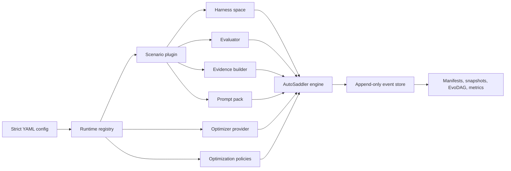
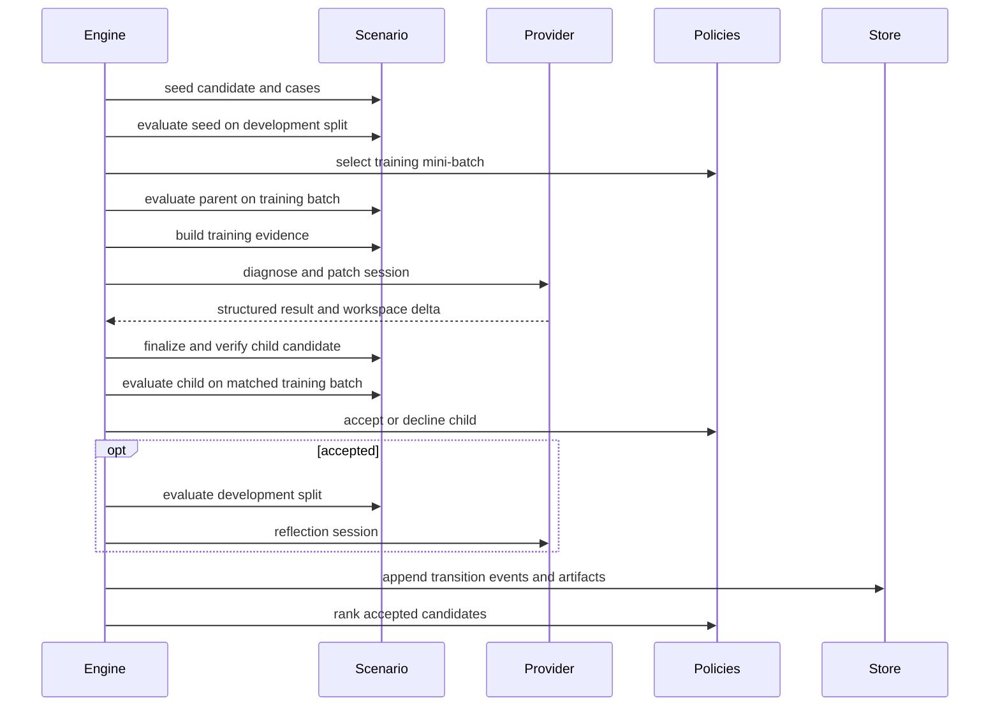

# AutoSaddler V2 Architecture

## Scope

V2 is the current implementation under `src/autosaddler/v2`. It optimizes an agent harness by
evaluating immutable candidates, asking an optimizer provider for structured changes, accepting only
policy-approved improvements, and recording every durable transition in an append-only event log.

V1 remains under `src/autosaddler/v1` for legacy reproduction. Its state files and worktrees are not
compatible with V2 runs and cannot be resumed or imported by the V2 engine.

## System Overview



The core engine depends on protocols rather than scenario or provider implementations. A scenario
owns the harness representation, cases, evaluation behavior, evidence, and prompt composition. A
provider owns model-session transport. Policies own task selection, acceptance, development
evaluation, ranking, and budget decisions.

## Package Boundaries

| Package | Responsibility |
|---|---|
| `config` | Strict YAML parsing, named component registry, external plugin discovery, and runtime assembly |
| `core` | Immutable domain records, optimization state machine, policies, events, and projections |
| `harness` | Content-addressed component-map and Git candidate spaces |
| `plugins` | Scenario-specific settings, evaluation, evidence, prompts, and verification |
| `prompting` | Session contracts, shared methodology assets, composition, and history rendering |
| `providers` | Optimizer session adapters for fake, Claude, and GitHub Copilot transports |
| `storage` | Local event store, artifacts, replay, snapshots, metrics, resume, and fork support |

Dependency direction points inward: plugins and providers implement protocols from `core` and
`prompting`; the engine does not import scenario-specific code.

## Runtime Assembly

Every V2 config starts with `schema_version: autosaddler/v2` and has four top-level sections:

- `scenario`: plugin type and plugin-owned settings;
- `optimization`: named policies, budgets, retries, and timeouts;
- `provider`: optimizer transport, declared capabilities, and provider settings; and
- `storage`: durable local run root.

`build_runtime()` parses exact keys, resolves each configured name through the registry, constructs
the scenario and provider, verifies provider capabilities against scenario requirements, initializes
the local store, and creates the engine. Unknown keys, names, capabilities, or storage types fail
before optimization starts.

The fake and Meta-ARE scenarios are built in. Separately installed scenario distributions register
a versioned `ScenarioPlugin` descriptor through the `autosaddler.scenarios` entry-point group.
Discovery is deterministic and fail-closed: malformed descriptors, unsupported API versions, entry
point/name mismatches, duplicate scenario names, missing distribution metadata, and load errors stop
runtime assembly. The engine continues to depend only on the returned `ScenarioComponents` bundle.

`resolved/scenario_runtime.json` records the scenario implementation version, plugin API version,
source kind, and, for an external plugin, its entry point and distribution version. These values are
part of run initialization, so resume rejects a changed plugin environment.

The checked-in `configs/v2/local_template.yaml` is dependency-free. The Meta-ARE example is
`configs/v2/meta_are_smoke.yaml`; it additionally verifies source commits, the GAIA2 source
descriptor and payload digests, dataset manifests, demo-filesystem provenance, mutation scope, and
runtime fingerprints.

## Domain Model

Candidates are immutable and content-addressed with `sha256:<hex>` identifiers. A seed has no
parents or change summary. Every child identifies unique parents and a concrete `ChangeSummary`.
The engine never treats a mutable workspace path as candidate identity.

A `Case` has a stable ID, a split (`train`, `development`, or `test`), and JSON-compatible payload
metadata. An `Observation` identifies one candidate, case, and repetition. It separates valid task
outcomes from execution errors and invalid attempts, and records score, artifacts, attempts, cost,
and metadata. An `Evaluation` preserves all requested case IDs and repetitions.

JSON conversion is strict: unsupported values and non-finite numbers raise errors. Run-relative
`ArtifactRef` values carry kind, digest, and byte-count metadata where available.

## Optimization Lifecycle



At later iterations the evolution session may select or compose accepted parents before diagnosis.
The engine applies the configured rollout and iteration budgets before starting work whose complete
cost cannot fit.

Train evidence can include case-level traces and scores. Development data is quarantined from
diagnosis: it is used for ranking and exposed to reflection only through permitted aggregate
feedback. Test payloads are outside optimization and are not opened by the engine.

## Harness Spaces

`ComponentMapHarnessSpace` stores a mapping of named text components and is useful for prompt-only or
structured harnesses. `GitHarnessSpace` pins an external repository commit, materializes isolated
worktrees, captures exact mutation deltas, enforces writable and forbidden paths, and verifies a
candidate before finalization.

Both implementations provide the same lifecycle:

1. create a content-addressed seed;
2. begin an isolated mutation session;
3. capture each provider attempt's delta;
4. apply the successful structured mutation;
5. finalize and verify an immutable child;
6. materialize candidates for evaluation; and
7. compute a durable parent-child change summary.

Temporary materializations expose an explicit release callback. Scenario evaluators must release
them even when evaluation fails.

## Provider Sessions And Prompts

The provider contract accepts a `SessionRequest` and returns a structured `SessionResult`. Prompt
packs produce a `SessionSpec` for `evolve`, `diagnose_patch`, and `reflect`, including:

- system and task prompts;
- skills and workspace context files;
- an executable JSON Schema output contract; and
- the capabilities required for that session.

Providers render these assets into their native workspace conventions. The engine validates output
against the session schema and records provider usage, tool calls, retries, deltas, and trace exports.
Provider trace exports may contain prompts, responses, tool arguments, command results, and paths;
treat the `sessions/` directory as sensitive.

Retries are durable. A resumed run reuses completed operations and evaluation attempts instead of
paying for them again. Exhausted evolution retries fail the run because selection lineage would be
undefined. Exhausted diagnosis retries record a no-proposal iteration; exhausted reflection retries
abandon only that deferred reflection.

## Events, Replay, And Artifacts

`events.jsonl` is the source of truth. Manifest, snapshot, EvoDAG, metrics, strategy history, and
result files are projections that can be rebuilt from events plus immutable artifacts.

```text
<run-root>/<run-id>/
|-- events.jsonl
|-- manifest.json
|-- snapshot.json
|-- evolution_dag.json
|-- metrics.jsonl
|-- metrics-summary.json
|-- result.json
|-- resolved/
|-- candidates/
|-- evaluations/
|-- sessions/
|-- mutation-deltas/
`-- workspaces/
```

Initialization records the fully resolved config, prompt sources, output schemas, policy choices,
scenario sources, and execution fingerprints. Reusing a run ID is permitted only when these inputs
are byte-identical. Otherwise initialization fails instead of mixing provenance.

Replay is idempotent at transition and external-operation boundaries. Evaluation attempts use stable
identities by candidate, case, repetition, and evaluator fingerprint. Provider attempts retain their
workspace deltas so a successful attempt can be recovered after a crash.

## Resume And Fork

Resume by rerunning the same config with the same run ID. The store replays events and continues from
the first incomplete durable operation.

A fork initializes a new run from a validated, nonterminal source sequence:

```bash
uv run python -m autosaddler.v2.cli \
  --config CONFIG.yaml \
  --run-id NEW_RUN_ID \
  --fork-from-run-id SOURCE_RUN_ID \
  --fork-through-sequence LAST_EVENT_SEQUENCE
```

Only `optimization.budget.max_iterations` may differ at fork initialization. Subsequent resumes use
the target run ID without fork flags.

## Safety Invariants

- Config parsing and registry lookup are fail-closed.
- Candidate IDs derive from content, not paths or mutable labels.
- Mutation happens only in isolated workspaces and within scenario-approved paths.
- Structured provider output is validated before it changes durable state.
- Train, development, and test splits are disjoint and retain their intended visibility.
- Event append precedes projection updates; projections are rebuildable.
- Resolved sources and execution settings are fingerprinted before paid work starts.
- Resume and fork reject incompatible configuration or provenance.

See `docs/scenario-integration.md` for the plugin implementation procedure.