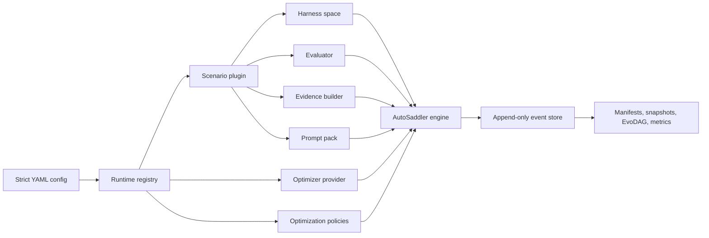
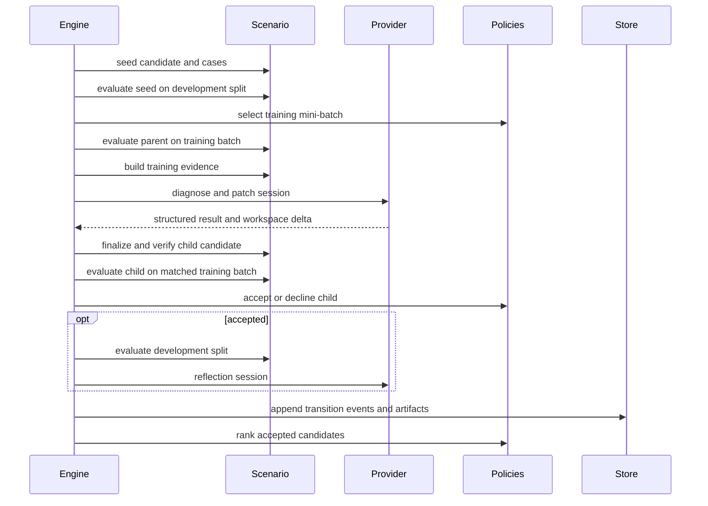
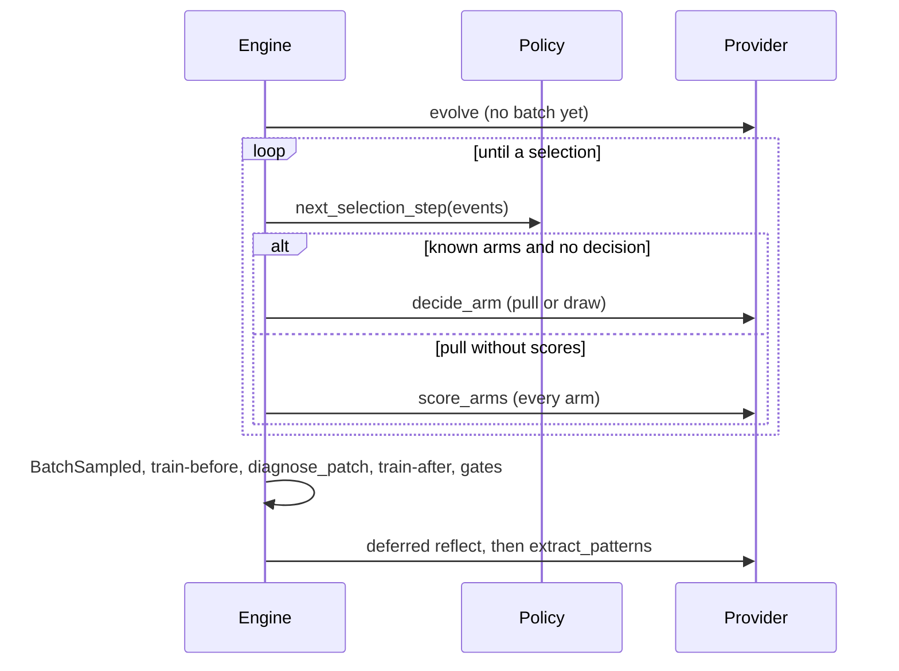

# AutoSaddler V2 Architecture

## Scope

V2 is the current implementation under `src/autosaddler/v2`. It optimizes an agent harness by
evaluating immutable candidates, asking an optimizer provider for structured changes, accepting only
policy-approved improvements, and recording every durable transition in an append-only event log.

V1 remains under `src/autosaddler/v1` for legacy reproduction. Its state files and worktrees are not
compatible with V2 runs and cannot be resumed or imported by the V2 engine.

## System Overview


```mermaid
flowchart LR
    C[Strict YAML config] --> R[Runtime registry]
    R --> S[Scenario plugin]
    R --> P[Optimizer provider]
    R --> O[Optimization policies]
    S --> H[Harness space]
    S --> E[Evaluator]
    S --> B[Evidence builder]
    S --> Q[Prompt pack]
    H --> X[AutoSaddler engine]
    E --> X
    B --> X
    Q --> X
    P --> X
    O --> X
    X --> L[Append-only event store]
    L --> A[Manifests, snapshots, EvoDAG, metrics]
```

The core engine depends on protocols rather than scenario or provider implementations. A scenario
owns the harness representation, cases, evaluation behavior, evidence, and prompt composition. A
provider owns model-session transport. Policies own task selection, acceptance, development
evaluation, ranking, and budget decisions.

## Package Boundaries

| Package | Responsibility |
|---|---|
| `config` | Strict YAML parsing, named component registry, external plugin discovery, and runtime assembly |
| `core` | Immutable domain records, optimization state machine, policies, events, and projections |
| `harness` | Content-addressed component-map and Git candidate spaces |
| `plugins` | Scenario-specific settings, evaluation, evidence, prompts, and verification |
| `prompting` | Session contracts, shared methodology assets, composition, and history rendering |
| `providers` | Optimizer session adapters for fake, Claude, GitHub Copilot, and Codex transports |
| `storage` | Local event store, artifacts, replay, snapshots, metrics, resume, and fork support |

Dependency direction points inward: plugins and providers implement protocols from `core` and
`prompting`; the engine does not import scenario-specific code.

## Runtime Assembly

Every V2 config starts with `schema_version: autosaddler/v2` and has four top-level sections:

- `scenario`: plugin type and plugin-owned settings;
- `optimization`: named policies, budgets, retries, and timeouts;
- `provider`: optimizer transport, declared capabilities, and provider settings; and
- `storage`: durable local run root.

`build_runtime()` parses exact keys, resolves each configured name through the registry, constructs
the scenario and provider, verifies provider capabilities against scenario requirements, initializes
the local store, and creates the engine. Unknown keys, names, capabilities, or storage types fail
before optimization starts.

The fake and Meta-ARE scenarios are built in. Separately installed scenario distributions register
a versioned `ScenarioPlugin` descriptor through the `autosaddler.scenarios` entry-point group.
Discovery is deterministic and fail-closed: malformed descriptors, unsupported API versions, entry
point/name mismatches, duplicate scenario names, missing distribution metadata, and load errors stop
runtime assembly. The engine continues to depend only on the returned `ScenarioComponents` bundle.

`resolved/scenario_runtime.json` records the scenario implementation version, plugin API version,
source kind, and, for an external plugin, its entry point and distribution version. These values are
part of run initialization, so resume rejects a changed plugin environment.

The checked-in `configs/v2/local_template.yaml` is dependency-free. The Meta-ARE example is
`configs/v2/meta_are_smoke.yaml`; it additionally verifies source commits, the GAIA2 source
descriptor and payload digests, dataset manifests, demo-filesystem provenance, mutation scope, and
runtime fingerprints.

## Domain Model

Candidates are immutable and content-addressed with `sha256:<hex>` identifiers. A seed has no
parents or change summary. Every child identifies unique parents and a concrete `ChangeSummary`.
The engine never treats a mutable workspace path as candidate identity.

A `Case` has a stable ID, a split (`train`, `development`, or `test`), and JSON-compatible payload
metadata. An `Observation` identifies one candidate, case, and repetition. It separates valid task
outcomes from execution errors and invalid attempts, and records score, artifacts, attempts, cost,
and metadata. An `Evaluation` preserves all requested case IDs and repetitions.

JSON conversion is strict: unsupported values and non-finite numbers raise errors. Run-relative
`ArtifactRef` values carry kind, digest, and byte-count metadata where available.

## Optimization Lifecycle


```mermaid
sequenceDiagram
    participant Engine
    participant Scenario
    participant Provider
    participant Policies
    participant Store

    Engine->>Scenario: seed candidate and cases
    Engine->>Scenario: evaluate seed on development split
    Engine->>Policies: select training mini-batch
    Engine->>Scenario: evaluate parent on training batch
    Engine->>Scenario: build training evidence
    Engine->>Provider: diagnose and patch session
    Provider-->>Engine: structured result and workspace delta
    Engine->>Scenario: finalize and verify child candidate
    Engine->>Scenario: evaluate child on matched training batch
    Engine->>Policies: accept or decline child
    opt accepted
        Engine->>Scenario: evaluate development split
        Engine->>Provider: reflection session
    end
    Engine->>Store: append transition events and artifacts
    Engine->>Policies: rank accepted candidates
```

At later iterations the evolution session may select or compose accepted parents before diagnosis.
The engine applies the configured rollout and iteration budgets before starting work whose complete
cost cannot fit.

Train evidence can include case-level traces and scores. Development data is quarantined from
diagnosis: it is used for ranking and exposed to reflection only through permitted aggregate
feedback. Test payloads are outside optimization and are not opened by the engine.

## Task Selection

Task selection is the training-data scheduling interface. `optimization.task_selection.type`
selects a registered policy, the policy returns a `TaskSelection(case_ids, provenance)`, and the
engine records it as `BatchSampled`.

- **Passive policies** (`fixed`, `epoch_shuffled`) implement `select(cases, iteration)` and choose
  the batch before the evolution session.
- **Adaptive policies** implement `AdaptiveTaskSelectionPolicy` in `core/scheduling.py`. They
  choose the batch after the working parent is prepared and may need optimizer sessions to do so.
  The policy describes that work and `AdaptiveTaskSelectionRunner` (`core/scheduling_runner.py`)
  executes it generically at a few engine hook points:
  - `next_selection_step` returns a `SessionStep`, a `StateStep`, a `TaskSelection`, or a
    `NoSelection` (the iteration completes as `no_selectable_cases`);
  - `iteration_changes` records state from an all-pass iteration;
  - `after_reflection` may return one `DeferredRequest`, run after reflection as deferred work.

  Each step result is appended as an `ExtensionStateChanged` event in the policy's namespace before
  the policy is consulted again, and every policy method is a pure function of replayed events, so
  a resumed run replays the same steps without repeating paid work. Policy settings live in
  `optimization.task_selection.settings` and are passed to any registered factory that declares a
  `settings` parameter. Each adaptive policy declares a `prompt_overlay` name; the runner adds it as
  `task_selection.prompt_overlay` to every session context it builds, and scenario prompt packs
  select extra prompt assets by that name rather than by the policy's registry name. Adaptive-only provenance (settings, extra session kinds, and scenario
  `task_selection_resolved_entities`) is recorded only for adaptive runs.

### ActiveSaddler

`task_selection.type: activesaddler` is the adaptive ActiveSaddler curriculum
(`core/curriculum.py`). Every failure pattern that owns at least one training case is a bandit
arm.


```mermaid
sequenceDiagram
    participant Engine
    participant Policy
    participant Provider
    Engine->>Provider: evolve (no batch yet)
    loop until a selection
        Engine->>Policy: next_selection_step(events)
        alt known arms and no decision
            Engine->>Provider: decide_arm (pull or draw)
        else pull without scores
            Engine->>Provider: score_arms (every arm)
        end
    end
    Engine->>Engine: BatchSampled, train-before, diagnose_patch, train-after, gates
    Engine->>Provider: deferred reflect, then extract_patterns
```

- **Order.** The working parent is prepared before the batch is sampled, so the evolution session
  receives no training case IDs and the batch is chosen for the prepared harness.
- **Draw.** Takes the next never-executed cases from a fixed permutation seeded by
  `task_selection.seed`. A cold start with no arm always draws without a decision session.
- **Draw epochs.** Once all offline training cases have been explored and every arm has since
  been visited, prior successes that did not instantiate an arm become eligible for exploration
  again, like additional epochs over seen examples. Concretely, when the current draw pool is
  empty and every current arm was the pulled arm of some iteration after the pool emptied, a
  `draw_epoch_opened` state change records the next epoch: the executed cases that own no arm, in
  a permutation seeded by `seed` and the epoch number. Draws then take that pool, and the epoch
  number appears in decision context and sampler provenance. With `min_prob: 0`, a rarely pulled
  arm can postpone the next epoch; set `min_prob > 0` to bound the delay.
- **Pull.** Samples one arm with probability `softmax(phi / softmax_temperature)` floored at
  `min_prob`, where `phi = (severity + fixability + breadth + (1 - side_effect)) / 4` is the agent's
  score for the current iteration, and evaluates up to `batch_size` of the arm's cases. The random
  generator is derived from the seed and iteration, so no RNG state is stored.
- **Extraction.** After a successful reflection with failing cases, a deferred `extract_patterns`
  session returns new patterns and pre- or post-patch tags as structured output. Its context lists
  each failure's scores and status, the diagnosis session's output (`IterationFeedback.patch_intent`),
  and the reflection lessons. The engine derives
  pattern IDs deterministically and records post-patch activity observations; a pattern created
  only from this iteration's post-patch tags is not observed. An all-pass batch observes every
  overlapping arm as inactive.
- **State.** Patterns, tags, observations, decisions, and scores are `ExtensionStateChanged` events
  in the `autosaddler.curriculum` namespace; the sampler snapshot is `BatchSampled.provenance`;
  executed cases and probe points are derived from existing events. `strategy/curriculum.json`
  projects the namespace, and sessions read `.autosaddler/curriculum/` for the replayed registry:
  patterns, per-arm pull histories (patch intent, development impact, per-case status and tagged
  root causes, and the lessons of each pull), and per-case histories. The evolution session does
  not receive it.
- **Failures.** An exhausted arm decision falls back to a pull. Arm scoring must rate every arm
  exactly once; exhausted arm scoring fails the run because unrated arms would silently score zero.
  Exhausted extraction abandons that obligation after recording observations.

The activity EMA (`ema_eta`) is shown to the agent only and does not influence selection. Curriculum
prompt assets live in `prompting/curriculum_methodology/` and `plugins/meta_are/curriculum/`,
outside the sources recorded for every run, and are recorded under `resolved/prompts/curriculum/`
only for ActiveSaddler runs. The Meta-ARE scenario pairs the curriculum with the optional
`capability_transition_mode: full_coverage` setting, which switches from capability to steering
patches after every training case has been sampled once, because repeated pulls make an iteration
count a poor proxy for coverage.

## Harness Spaces

`ComponentMapHarnessSpace` stores a mapping of named text components and is useful for prompt-only or
structured harnesses. `GitHarnessSpace` pins an external repository commit, materializes isolated
worktrees, captures exact mutation deltas, enforces writable and forbidden paths, and verifies a
candidate before finalization.

Both implementations provide the same lifecycle:

1. create a content-addressed seed;
2. begin an isolated mutation session;
3. capture each provider attempt's delta;
4. apply the successful structured mutation;
5. finalize and verify an immutable child;
6. materialize candidates for evaluation; and
7. compute a durable parent-child change summary.

Temporary materializations expose an explicit release callback. Scenario evaluators must release
them even when evaluation fails.

## Provider Sessions And Prompts

The provider contract accepts a `SessionRequest` and returns a structured `SessionResult`. Prompt
packs produce a `SessionSpec` for `evolve`, `diagnose_patch`, and `reflect`, and, when a scenario
declares them in `supported_session_kinds`, for the curriculum kinds `extract_patterns`,
`decide_arm`, and `score_arms`. Each spec includes:

- system and task prompts;
- skills and workspace context files;
- an executable JSON Schema output contract; and
- the capabilities required for that session.

Providers render these assets into their native workspace conventions. The engine validates output
against the session schema and records provider usage, tool calls, retries, deltas, and trace exports.
Provider trace exports may contain prompts, responses, tool arguments, command results, and paths;
treat the `sessions/` directory as sensitive.

Retries are durable. A resumed run reuses completed operations and evaluation attempts instead of
paying for them again. Exhausted evolution retries fail the run because selection lineage would be
undefined. Exhausted diagnosis retries record a no-proposal iteration; exhausted reflection retries
abandon only that deferred reflection.

## Events, Replay, And Artifacts

`events.jsonl` is the source of truth. Manifest, snapshot, EvoDAG, metrics, strategy history, and
result files are projections that can be rebuilt from events plus immutable artifacts.

```text
<run-root>/<run-id>/
|-- events.jsonl
|-- manifest.json
|-- snapshot.json
|-- evolution_dag.json
|-- metrics.jsonl
|-- metrics-summary.json
|-- result.json
|-- strategy/
|-- resolved/
|-- candidates/
|-- evaluations/
|-- sessions/
|-- mutation-deltas/
`-- workspaces/
```

Initialization records the fully resolved config, prompt sources, output schemas, policy choices,
scenario sources, and execution fingerprints. Reusing a run ID is permitted only when these inputs
are byte-identical. Otherwise initialization fails instead of mixing provenance.

Replay is idempotent at transition and external-operation boundaries. Evaluation attempts use stable
identities by candidate, case, repetition, and evaluator fingerprint. Provider attempts retain their
workspace deltas so a successful attempt can be recovered after a crash.

## Resume And Fork

Resume by rerunning the same config with the same run ID. The store replays events and continues from
the first incomplete durable operation.

A fork initializes a new run from a validated, nonterminal source sequence:

```bash
uv run python -m autosaddler.v2.cli \
  --config CONFIG.yaml \
  --run-id NEW_RUN_ID \
  --fork-from-run-id SOURCE_RUN_ID \
  --fork-through-sequence LAST_EVENT_SEQUENCE
```

Only `optimization.budget.max_iterations` may differ at fork initialization. Subsequent resumes use
the target run ID without fork flags.

## Safety Invariants

- Config parsing and registry lookup are fail-closed.
- Candidate IDs derive from content, not paths or mutable labels.
- Mutation happens only in isolated workspaces and within scenario-approved paths.
- Structured provider output is validated before it changes durable state.
- Train, development, and test splits are disjoint and retain their intended visibility.
- Event append precedes projection updates; projections are rebuildable.
- Resolved sources and execution settings are fingerprinted before paid work starts.
- Resume and fork reject incompatible configuration or provenance.

See `docs/scenario-integration.md` for the plugin implementation procedure.
